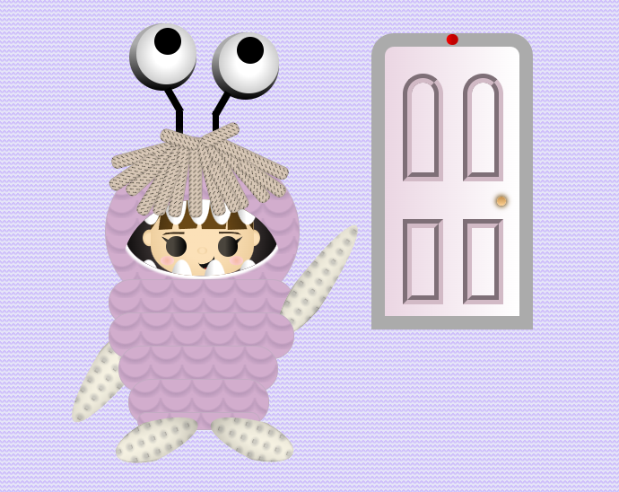

#  Funko Pop de Boo – HTML & CSS Drawing 🎨

Este proyecto es una ilustración realizada únicamente con **HTML y CSS**, que representa al personaje **Boo** de *Monsters Inc.* en estilo **Funko Pop**. Fue creada como ejercicio de diseño web creativo y precisión con propiedades CSS.

##  Vista previa 📷



> ✨ Resultado final

1. Clona este repositorio:

   ```bash
   git clone https://github.com/ariadna-ge/pixeles.git
   ```
2. Abre `index.html` en tu navegador favorito.

## Tecnologías usadas 🛠️

* HTML5
* CSS3 

##  Notas 📌
* El diseño fue hecho principalmente para escritorio.
* Este proyecto es solo con fines educativos y de entretenimiento. *Boo*, *Monsters Inc.*, y *Funko Pop* son marcas registradas de sus respectivos propietarios.

## Créditos 🎀

Diseñado y desarrollado por [ariadna-ge](https://github.com/ariadna-ge).
Inspirado en el personaje **Boo** y los diseños de **Funko Pop**.
